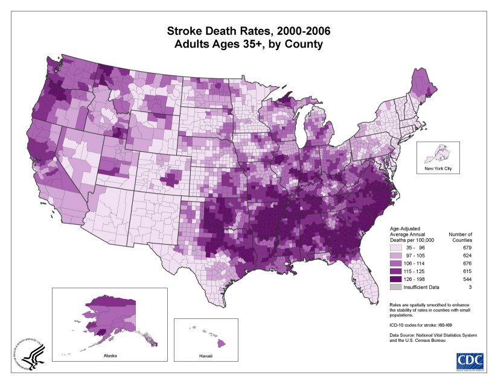

```{r setup, include = FALSE}
library(tidyverse)
library(plotly)
library(ggrepel)
library(maps)

knitr::opts_chunk$set(echo = TRUE, fig.align="center")
```

# Introduction

The Opioid Crisis is truly that - a crisis. Over the past 20 years, opioids have become a commonly used recreational drug. As people use these drugs, they become addicted. Opioid abuse often starts with a legitimate prescription as a treatment for pain. In small doses, opioids are effective painkillers that may make you feel drowsy. However, the addictive nature of the drug can cause people to seek out more opioids after their prescription is over. In large doses, also known as abuse, opioids can result in slowed breathing and a slowed heart-rate. These effects can cause death - otherwise known as an overdose. 

The amount of opioids prescribed began growing in 2006 and peaked in 2012 with 255 million doses prescribed. Since 2012, overall doses prescribed has diminished to 168 million in 2018; however, that is still a huge number of opioid doses. More information about opioid prescribing rates can be found here: https://www.cdc.gov/drugoverdose/maps/rxrate-maps.html. Unfortunately, overdoses have also been on the rise and - unlike prescriptions - are continuing to rise, as can be seen in the figure below.


The mechanism by which legitimate prescriptions may lead to opioid abuse and potential overdose is addiction. When someone is legally prescribed opioids (potentially an excessive number of doses) they are subject to developing an addiction. If they do, then they may go searching for more opioids after their prescription runs out. The most common replacements are drugs like heroin and fentanyl, which are over 100 times the strength of morphine - a notoriously powerful painkiller. These powerful opioids can easily lead to overdose even after just one use. It is also worth noting that even ordinary prescription opioids cause deaths, not just the super strong types. 

For this project, we wanted to explore the relationship between opioid prescription rate and overdose rate and figure out which (if any) states are disproportionately affected by the opioid epidemic. 

# Data

```{r, include = FALSE, warning = FALSE}
# Read in data
prescription_data <- readRDS(file = "prescription_data.rds")
overdose_data <- readRDS(file = "all_overdoses.rds")
west_virginia_data <- readRDS(file = "west_virginia_map_data.rds") %>% 
  filter(Year == 2014) %>% 
  rename(`Prescription Rate` = Prescription_Rate)

# Join data for regression/clustering
full_data <- left_join(prescription_data, overdose_data, by = c("year", "State")) %>% 
  janitor::clean_names() %>% 
  select(state, year, prescription_rate, age_adjusted_rate)

# Initialize map data
usa_states <- map_data(map = "state", region = ".")
```

## Prescription Rate Data 

The data we used to determine the prescription rate for each state comes from the [CDC's website](https://www.cdc.gov/drugoverdose/maps/rxrate-maps.html#:~:text=The%20overall%20national%20opioid%20prescribing%20rate%20declined%20from%202012%20to,168%20million%20total%20opioid%20prescriptions). It includes data for each state - and summary data for the entire US - for overall opioid prescription doses and opioid prescription rate (per 100 persons) for the years 2006 - 2018. Although the data contained 12 years worth of prescribing information, we only used 2014 - 2018 because of the availability of matching overdose data. 

## Overdose Rate Data 

The data we used to find the Overdose Rate also came from the [CDC's website](https://www.cdc.gov/drugoverdose/data/statedeaths.html). It includes overdose data from each state with columns that include, state name, death rate range, age adjusted overdose rate, and total number of overdose deaths. Age adjusted rate can be define as the death rate that controls for the effects of differences in population age distributions. 

# Prescription Rate vs. Overdose Rate

## Prescription Rate Maps {.tabset .tabset-fade .tabset-pills}

```{r, echo = FALSE, warning = FALSE}
# Function to output prescription rate map to avoid repeating code
prescription_map <- function(prescription_data, year_to_change) {
  
  # Join prescription data to map data
  prescription_map <- prescription_data %>% 
    filter(year == year_to_change) %>% 
    inner_join(usa_states, by = c("state" = "region")) %>%
    rename(`Prescription Rate` = prescription_rate)
  
  # Plot prescription rate data in a map
  ggplotly(
    ggplot(prescription_map, aes(x = long, y = lat, group = group, fill = `Prescription Rate`)) +
    geom_polygon(color = "white", aes(text = paste0('State: ', str_to_title(state)))) +
    theme_void() +
    coord_fixed(ratio = 1.3) +
    labs(fill = "Prescription Rate") +
    theme(legend.position = "bottom") +
    scale_fill_distiller(palette = "Oranges", direction = 2) + 
    ggtitle(paste0("Opioid Prescription Rates in ", year_to_change))
  )
}
```


### 2014

```{r, echo = FALSE, warning = FALSE}
prescription_map(prescription_data, 2014)
```

### 2015

```{r, echo = FALSE, warning = FALSE}
prescription_map(prescription_data, 2015)
```

### 2016

```{r, echo = FALSE, warning = FALSE}
prescription_map(prescription_data, 2016)
```

### 2017

```{r, echo = FALSE, warning = FALSE}
prescription_map(prescription_data, 2017)
```

### 2018

```{r, echo = FALSE, warning = FALSE}
prescription_map(prescription_data, 2018)
```

## Overdose Rate Maps {.tabset .tabset-fade .tabset-pills}

```{r, echo = FALSE, warning = FALSE}
# Function to output prescription rate map to avoid repeating code
overdose_map <- function(overdose_data, year_to_change) {
  
  # Join overdose rate data to map data
  overdose_map <- overdose_data %>% 
    filter(year == year_to_change) %>% 
    mutate(State = tolower(State)) %>% 
    inner_join(usa_states, by = c("State" = "region")) %>% 
    rename(`Overdose Rate` = Age.Adjusted.Rate)
  
  # Plot overdose rate data in a map
  ggplotly(
    ggplot(overdose_map, aes(x = long, y = lat, group = group, fill = `Overdose Rate`)) +
      geom_polygon(color = "white", aes(text = paste0('State: ', 
                                        str_to_title(State), 
                                        '<br>', 
                                        'Deaths: ', Deaths))) +
      theme_void() +
      coord_fixed(ratio = 1.3) +
      labs(fill = "Overdose Rate") +
      theme(legend.position = "bottom") +
      ggtitle(paste0("Opioid Overdose Rates in ", year_to_change)) + 
      scale_fill_distiller(palette = "Blues", direction = 2)
  )
}
```

### 2014

```{r, echo = FALSE, warning = FALSE}
overdose_map(overdose_data, 2014)
```

### 2015

```{r, echo = FALSE, warning = FALSE}
overdose_map(overdose_data, 2015)
```

### 2016

```{r, echo = FALSE, warning = FALSE}
overdose_map(overdose_data, 2016)
```

### 2017

```{r, echo = FALSE, warning = FALSE}
overdose_map(overdose_data, 2017)
```

### 2018

```{r, echo = FALSE, warning = FALSE}
overdose_map(overdose_data, 2018)
```

## Analysis

In the first maps we can see how the prescription rate for opioids has changed from 2014 to 2018. It's clear that policies instituted by the FDA in the late 2000s have come into effect, where nearly every state has lowered their prescription rate for opiates each year. Some interesting states to highlight include Alabama and West Virginia with prescription rates of 126 and 135 respectively per one hundred persons in 2014. These two states are on the higher end of the prescription rates in the US and later we can look into how this could play a roll in the overdose rates in both these states.

The next graphs are the Overdose rates per state from 2014 to 2018. Here we can see that overdoses have been substantially increasing each year since 2014. What's interesting here is that many states with high prescription rates also have very high overdose rates which alludes to the possibility that prescription rate may contribute to the overdose rate in a state. West Virginia is known for having the worst opioid problem in the United States and the overdose rate here increases from 35.5 to 51.5 over the five year span. The opioid crisis is getting worse every year however, if states continue to keep lowering their prescription rates perhaps this can help to solve the problem. 

# Pearson's Correlation Test

```{r, echo = FALSE, message = FALSE, warning = FALSE}
# Filtering for 2014 data
data_2014 <- filter(full_data, year == 2014)

# Checking linearity
ggplotly(
ggplot(data = data_2014, aes(x = prescription_rate, y = age_adjusted_rate)) +
  geom_point(aes(color = age_adjusted_rate,
                 text = paste0('<b>State</b>: ', str_to_title(state),
                              '<br>', 
                              '<b>Prescription Rate</b>: ', prescription_rate,
                              '<br>', 
                              '<b>Overdose Rate</b>: ', age_adjusted_rate))) +
  geom_smooth(method = lm) +
  theme(legend.position = "none") +
  labs(x = "Prescription Rate", y = "Age Adjusted Overdose Rate") + 
  ggtitle("Prescription Rate vs Overdose Rate"),
tooltip = "text"
)
```

```{r eval = FALSE, echo = FALSE}
# Checking normality
ggpubr::ggqqplot(data_2014$age_adjusted_rate, ylab = "Overdose Rate")
ggpubr::ggqqplot(data_2014$prescription_rate, ylab = "Prescription Rate")
```

```{r warning = FALSE, echo = FALSE, comment = NA}
# Running Pearson's correlation test
cor.test(data_2014$age_adjusted_rate, data_2014$prescription_rate)
```

One example of a statistical analysis to determine whether or not two variables are correlated is the Pearson's correlation test. We chose to run this test on 2014 data specifically because it was the worst in terms of overdoses in our data. The conditions for this test seem satisfied because there is a linear relationship present between the variables and both variables mostly follow a normal distribution (there is some deviation from the QQ line, but the consequences of assumed normality are not detrimental here because we are not using this test to predict). The p-value of this test is less than the standard $\alpha$ = 0.05, so we can conclude that prescription rate and age adjusted overdose rate are significantly correlated with a correlation coefficient of 0.394.

# K-Means Clustering

Clustering is a machine learning method used to group together observations with similar characteristics. In this scenario, we are grouping together U.S. states by their respective prescription rates and overdose rates (age adjusted). These variables were selected because they take into account the discrepancies in population size, which allows for comparisons between less densely-populated states like Vermont to more populated states such as New York. Through this clustering analysis, we can classify states that are disproportionately affected by the opioid epidemic.

## Determining the Optimal K

While oftentimes you have to determine the optimal k for k-means clustering yourself, we wrote code to determine it for you. We determined the optimal k by selecting the largest mean silhouette score. The silhouette coefficient is a measure of how similar an observation is to its own cluster compared to other clusters. The values range from -1 (samples are assigned to the wrong cluster) to 1 (best possible value). The function below runs k-mean clustering on a given k, and then calculates mean silhouette score using the `silhouette` function from the `cluster` package. We are providing k inputs from 2-5, and then searching for the largest value. It is impo

```{r}
# Helper function to calculate mean silhouette coefficient
silhouette_score <- function(k, full_data){
  km <- kmeans(full_data[, 2:3], centers = k, nstart = 20)
  score <- cluster::silhouette(km$cluster, dist(full_data[, 2:3]))
  mean(score[, 3])
}
```

```{r eval = FALSE}
# Follow up code to get the maximum silhouette coefficient
k <- 2:5

# Apply the helper function for k values of 2-5
avg_sil <- sapply(k, silhouette_score)

# Add 1 because data frame rows are from 1-4 and we put in 2-5
optimal_k <- which(as.data.frame(avg_sil)$avg_sil == max(avg_sil)) + 1
```

## Clustering for 2014-2018 {.tabset .tabset-fade .tabset-pills}

```{r echo = FALSE, warning = FALSE, message = FALSE}
# Function to output clustering graphs to avoid repeating code

clustering_graphs <- function(full_data, year_to_change) {
  
  # Ensure states are in the same cluster
  set.seed(1106)
  full_data <- full_data %>% 
    filter(year == year_to_change) %>% 
    mutate_if(is.numeric, funs(`std`=scale(.) %>% as.vector())) %>% 
    select(state, prescription_rate_std, age_adjusted_rate_std)
  
  k <- 2:5
  avg_sil <- sapply(k, silhouette_score, full_data = full_data)
  optimal_k <- which(as.data.frame(avg_sil)$avg_sil == max(avg_sil)) + 1
  
  km <- kmeans(full_data[, 2:3], centers = optimal_k, nstart = 20)
  full_data <- mutate(full_data, cluster = as.character(km$cluster))
  
  # Visualize clustering through a scatterplot
  graph1 <- ggplot(data = full_data, aes(x = prescription_rate_std, y = age_adjusted_rate_std)) + 
    geom_point(aes(color = cluster)) +
    geom_text_repel(aes(label = state, color = cluster), size = 3) +
    geom_point(data = as.data.frame(km$centers)
               , aes(x = prescription_rate_std, y = age_adjusted_rate_std)
               , pch = "X"
               , size = 3) +
    labs(x = "Standardized Prescription Rate", y = "Standardized Overdose Rate", 
         color = "Cluster Assignment") + 
    ggtitle(paste0("Clustering for ", year_to_change))
  
  # Visualize clustering spatially
  usa_states <- map_data(map = "state", region = ".") %>% 
    mutate(state = stringr::str_to_title(region))
  
  cluster_map <- full_data %>%
    inner_join(usa_states, by = "state")
  
  graph2 <- ggplot(cluster_map, aes(x = long, y = lat, group = group, fill = cluster)) +
        geom_polygon(color = "white") +
        theme_void() +
        coord_fixed(ratio = 1.3) +
        labs(title = "Visualizing the Clusters",
             fill = "Cluster #") +
        theme(legend.position="right")
  
  # Return as a list so you can return multiple graphs in a single function
  return(list(graph1, graph2))
}
```

### 2014

```{r echo = FALSE, warning = FALSE, message = FALSE}
clustering_graphs(full_data, 2014)[[1]]
clustering_graphs(full_data, 2014)[[2]]
```

### 2015

```{r echo = FALSE, warning = FALSE, message = FALSE}
clustering_graphs(full_data, 2015)[[1]]
clustering_graphs(full_data, 2015)[[2]]
```

### 2016

```{r echo = FALSE, warning = FALSE, message = FALSE}
clustering_graphs(full_data, 2016)[[1]]
clustering_graphs(full_data, 2016)[[2]]
```

### 2017

```{r echo = FALSE, warning = FALSE, message = FALSE}
clustering_graphs(full_data, 2017)[[1]]
clustering_graphs(full_data, 2017)[[2]]
```

### 2018

```{r echo = FALSE, warning = FALSE, message = FALSE}
clustering_graphs(full_data, 2018)[[1]]
clustering_graphs(full_data, 2018)[[2]]
```

## Analysis

In the clustering graph, states in the top right quadrant are classified as high risk for an opioid crisis. In these states, individuals are prescribed opioid/narcotic prescriptions at a higher rate and are also overdosing at greater proportions. Conversely, states in the bottom left quadrant are classified as low risk as they have low prescription and overdose rates. Geographically, southern states (i.e. Alabama, Louisiana, Tennessee, Mississippi, etc.) tend to cluster together. The same trend was evident in midwestern states (North and South Dakota, Minnesota, Nebraska, etc.). This suggests that states with geographic commonalities also share similar risks of opioid crises. These states that are identified as high risk can also be targeted for public policies, as physicians should be urged to prescribe opioids much more conservatively.


# Shiny App

To interact with these plots further, visit: https://swei1999.shinyapps.io/Blog-Pill-Posse/.

# Conclusion

## Answering Our Questions Of Interest

**1. How do prescription rates affect overdose rates in every state?**

Looking at each year individually, it's clear that the states with the highest prescription rates also have the highest overdose rates. Given our prescription rate maps and overdose rate maps along with the linear regression model, it's fair to say that there is some correlation between the states with the highest prescription rates and the states with the highest overdose rate. If you take a look at the beginning of the the opioid epidemic, it initially started when doctors began to over prescribe opioids as pain medication. As more prescriptions were written, the problem slowly got out of hand and led to hundreds of thousands of Americans becoming addicted to opiates. When the FDA finally decided to more heavily regulate opioid prescriptions, the cat was already out of the bag and we now have an epidemic on our hands.

**2. Which states seem to have been most impacted by the opioid crisis?**

Throughout 2014-2018, the states most strongly impacted by the opioid epidemic are primarily located across the east and south-eastern United States. In particular, southern states are consistently grouped together as high risk (with high rates of prescriptions and overdoses). Notably, West Virginia was constantly among the highest risk states.

It is interesting to note that the general pattern of high risk states located in the east and south east US reflects numerous current public health trends. More specifically, the distribution of several cardiovascular diseases follows almost the same distribution as seen here. For example, the “Stroke Belt,” (pictured below) was recognized by public health officials as presenting notably high incidence of stroke. While the graphic  displays data from the 2000s, this same trend has been documented repeatedly over the past two decades. This sweeping pattern of poor health across the east-to-south-east US has also been reported in other conditions, such as obesity. This general trend **suggests** that perhaps the same factors that are instrumental to the poor health of these states are also contributing to their classification as high risk for an opioid crisis.




**3. What other factors could potentially contribute to high overdose rates other than prescription rates that we haven’t explored?**

Prescription rates aren't the only factor contributing to overdose rates throughout the United State. Other factors such as naloxone availability, poverty, and access to hospitals could absolutely play a role in contributing to overdose rates in the US. 

## Limitations

Although we were able to access national opioid data from the CDC that suited our needs, the data was not the most detailed. We struggled to come across any national opioid data that had numerous variables for us to explore. IQVIA, a health information-based data science company, is one of the sole providers of detailed prescription data in the US. Unfortunately for us, datasets that come from companies like IQVIA datasets cost money and are perhaps too large for our computers to handle.

## Possible Next Steps

We think next steps for our project could include going down to the county level and further exploring the opioid crisis from there. Looking into the county level crisis could allow us to highlight where the problems are the most potent in each state. For example, identifying which counties are mostly affected by the epidemic could help the state in providing funds and aid to the counties in need. Here’s a look into what a map of prescription rates in West Virginia would look like if we continued with our next steps.

```{r, echo = FALSE, warning = FALSE}
# Plot 2014 West Virginia county data
ggplotly(
  ggplot(west_virginia_data, mapping = aes(long, lat, group = group, fill = `Prescription Rate`)) +
  geom_polygon(size = .25, aes(text = paste0('County: ', str_to_title(County)))) +
  theme_void() +
  theme(legend.position="right") +
  scale_fill_distiller(palette = "Green", direction = 2)+
  labs(fill = "Prescription Rate")+
  ggtitle(label = "Prescription Rates in West Virgnia in 2014")
)
```

Other next steps could include analyzing more variables we believe could potentially contribute to the ever increasing severity of the opioid epidemic in the United States. 