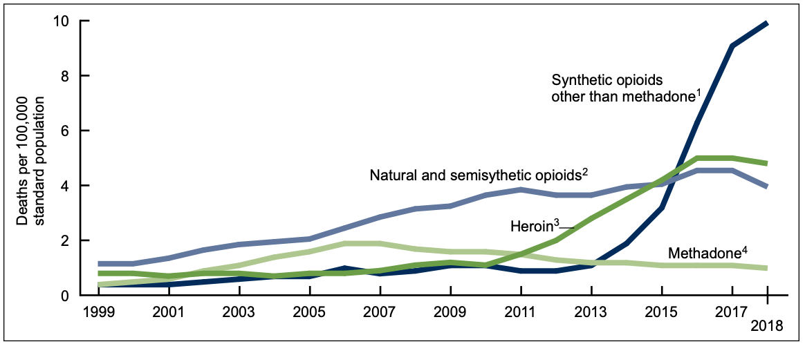

```{r setup, include = FALSE}
library(tidyverse)
library(plotly)
library(ggrepel)
library(maps)
library(mosaic)

knitr::opts_chunk$set(echo = TRUE, fig.align="center")
```

# Introduction

The Opioid Crisis is truly that - a crisis. Over the past 20 years, opioids have become a commonly used recreational drug. As people use these drugs, they become addicted. Opioid abuse often starts with a legitimate prescription as a treatment for pain. However, the addictive nature of the drug can cause people to seek out more opioids after their prescription is over. In small doses, opioids are effective painkillers that may make you feel drowsy. In large doses (abuse), opioids can result in slowed breathing and a slowed heart-rate. These effects can cause death - otherwise known as an overdose. 

The amount of opioids prescribed began growing a lot in 2006 and peaked in 2012 with 255 million doses prescribed. Since 2012, overall doses prescribed has diminished to 168 million in 2018; however, that is still a huge number of opioid doses. Unfortunately, overdoses have also been on the rise and - unlike prescriptions - are continuing to rise (as can be seen in the figure below).



The mechanism by which legitimate prescriptions may lead someone down the path to opioid abuse and potentially overdosing is one of addiction. When someone is legally prescribed opioids (potentially an excessive number of doses) they are subject to developing an addiction. If they do, then they may go searching for more opioids after their prescription runs out. The most common replacements are drugs like heroin and fentanyl. Heroin and fentanyl, which is over 100 times the strength of morphine - a notoriously powerful painkiller, are very strong opioids that can very easily lead to overdose even after just one use. It is also worth noting that even prescription opioids cause deaths, not just the super strong types. 

For this project, we wanted to explore the relationship between opioid prescription rate and overdose rate and figure out which (if there are any) states that are disproportionately affected. 

# Data

## Prescription Rate Data 

The data we used to determine the prescription rate for each state comes from the [CDC's website](https://www.cdc.gov/drugoverdose/maps/rxrate-maps.html#:~:text=The%20overall%20national%20opioid%20prescribing%20rate%20declined%20from%202012%20to,168%20million%20total%20opioid%20prescriptions). It includes data for each state - and summary data for the entire US - for overall opioid prescription doses and opioid prescription rate (per 100 persons) for the years 2006 - 2018. Although the data contained 12 years worth of prescribing information, we only used 2014 - 2018 because of the availability of matching overdose data. 

## Overdose Rate Data 

Where data is from 
explain what it is

# Prescription Rate vs. Overdose Rate

1. Show maps
2. Ask Questions about whether one causes the other, etc.


```{r, include = FALSE, warning = FALSE}
# Read in data
prescription_data <- readRDS(file = "prescription_data.rds")
overdose_data <- readRDS(file = "all_overdoses.rds")
west_virginia_data <- readRDS(file = "west_virginia_map_data.rds")

full_data <- left_join(prescription_data, overdose_data, by = c("year", "State")) %>% 
  janitor::clean_names() %>% 
  select(state, year, prescription_rate, age_adjusted_rate)

# Initialize map data
usa_states <- map_data(map = "state", region = ".")

west_virginia_data <- west_virginia_data %>%
  filter(Year == 2014)%>%
  rename(`Prescription Rate` = Prescription_Rate)
```

## Prescription Rate Maps {.tabset .tabset-fade .tabset-pills}

### 2014
```{r, echo=FALSE, warning=FALSE}
# Grabbing 2014 Data
prescription_map_2014 <- prescription_data %>% 
        filter(year == "2014") %>% 
        inner_join(usa_states, by = c("state" = "region")) %>%
        rename(`Prescription Rate` = prescription_rate)
# Plot 2014 Prescription Rate data
ggplotly(
  ggplot(prescription_map_2014, aes(x = long, y = lat, group = group, fill = `Prescription Rate`)) +
  geom_polygon(color = "white", aes(text = paste0('State: ', str_to_title(state)))) +
  theme_void() +
  coord_fixed(ratio = 1.3) +
  labs(fill = "Prescription Rate") +
  theme(legend.position = "bottom") +
  scale_fill_distiller(palette = "Oranges", direction = 2) + 
  ggtitle("Opioid Prescription Rates - 2014")
)
```

### 2015
```{r, echo=FALSE, warning=FALSE}
# Grabbing 2015 Data
prescription_map_2015 <- prescription_data %>% 
        filter(year == "2015") %>% 
        inner_join(usa_states, by = c("state" = "region")) %>%
        rename(`Prescription Rate` = prescription_rate)
# Plot 2015 Prescription Rate data
ggplotly(
  ggplot(prescription_map_2015, aes(x = long, y = lat, group = group, fill = `Prescription Rate`)) +
  geom_polygon(color = "white", aes(text = paste0('State: ', str_to_title(state)))) +
  theme_void() +
  coord_fixed(ratio = 1.3) +
  labs(fill = "Prescription Rate") +
  theme(legend.position = "bottom") +
  scale_fill_distiller(palette = "Oranges", direction = 2) + 
  ggtitle("Opioid Prescription Rates - 2015")
)
```

### 2016
```{r, echo=FALSE, warning=FALSE}
# Grabbing 2016 Data
prescription_map_2016 <- prescription_data %>% 
        filter(year == "2016") %>% 
        inner_join(usa_states, by = c("state" = "region")) %>%
        rename(`Prescription Rate` = prescription_rate)
# Plot 2016 Prescription Rate data
ggplotly(
  ggplot(prescription_map_2016, aes(x = long, y = lat, group = group, fill = `Prescription Rate`)) +
  geom_polygon(color = "white", aes(text = paste0('State: ', str_to_title(state)))) +
  theme_void() +
  coord_fixed(ratio = 1.3) +
  labs(fill = "Prescription Rate") +
  theme(legend.position = "bottom") +
  scale_fill_distiller(palette = "Oranges", direction = 2) + 
  ggtitle("Opioid Prescription Rates - 2016")
)
```

### 2017
```{r, echo=FALSE, warning=FALSE}
# Grabbing 2017 Data
prescription_map_2017 <- prescription_data %>% 
        filter(year == "2017") %>% 
        inner_join(usa_states, by = c("state" = "region")) %>%
        rename(`Prescription Rate` = prescription_rate)
# Plot 2017 Prescription Rate data
ggplotly(
  ggplot(prescription_map_2017, aes(x = long, y = lat, group = group, fill = `Prescription Rate`)) +
  geom_polygon(color = "white", aes(text = paste0('State: ', str_to_title(state)))) +
  theme_void() +
  coord_fixed(ratio = 1.3) +
  labs(fill = "Prescription Rate") +
  theme(legend.position = "bottom") +
  scale_fill_distiller(palette = "Oranges", direction = 2) + 
  ggtitle("Opioid Prescription Rates - 2017")
)
```

### 2018
```{r, echo=FALSE, warning=FALSE}
# Grabbing 2018 Data
prescription_map_2018 <- prescription_data %>% 
        filter(year == "2018") %>% 
        inner_join(usa_states, by = c("state" = "region")) %>%
        rename(`Prescription Rate` = prescription_rate)
# Plot 2018 Prescription Rate data
ggplotly(
  ggplot(prescription_map_2018, aes(x = long, y = lat, group = group, fill = `Prescription Rate`)) +
  geom_polygon(color = "white", aes(text = paste0('State: ', str_to_title(state)))) +
  theme_void() +
  coord_fixed(ratio = 1.3) +
  labs(fill = "Prescription Rate") +
  theme(legend.position = "bottom") +
  scale_fill_distiller(palette = "Oranges", direction = 2) + 
  ggtitle("Opioid Prescription Rates - 2018")
)
```

With these maps we can see how the prescription rate for opioids has changed from 2014 to 2018. It's clear that policies instituted by the FDA in the late 2000s have come into effect, where nearly every state has lowered their prescription rate for opiates each year. Some interesting states to highlight include Alabama and West Virginia with prescription rates of 126 and 135 respectively per one hundred persons. These two states are on the higher end of the prescription rates in the US and later we can look into how this could play a roll in the overdose rates in both these states.  

## Overdose Rate Maps {.tabset .tabset-fade .tabset-pills}

### 2014
```{r, echo=FALSE, warning=FALSE}
# Grabbing 2014 Data
overdose_map_2014 <- overdose_data %>% 
        filter(year == "2014") %>% 
        mutate(State = tolower(State)) %>% 
        inner_join(usa_states, by = c("State" = "region")) %>% 
        rename(`Overdose Rate` = Age.Adjusted.Rate)
# Plot 2014 Overdose Rate data  
ggplotly(
  ggplot(overdose_map_2014, aes(x = long, y = lat, group = group,
                                   fill = `Overdose Rate`)) +
        geom_polygon(color = "white", 
                     aes(text = paste0('State: ', 
                                      str_to_title(State), 
                                      '<br>', 
                                      'Deaths: ', Deaths))) +
        theme_void() +
        coord_fixed(ratio = 1.3) +
        labs(fill = "Overdose Rate") +
        theme(legend.position = "bottom") +
        ggtitle("Opioid Overdose Rates - 2014") +
        scale_fill_distiller(palette = "Blues", direction = 2)
)
```

### 2015
```{r, echo=FALSE, warning=FALSE}
# Grabbing 2015 Data
overdose_map_2015 <- overdose_data %>% 
        filter(year == "2015") %>% 
        mutate(State = tolower(State)) %>% 
        inner_join(usa_states, by = c("State" = "region")) %>% 
        rename(`Overdose Rate` = Age.Adjusted.Rate)
# Plot 2015 Overdose Rate data  
ggplotly(
  ggplot(overdose_map_2015, aes(x = long, y = lat, group = group,
                                   fill = `Overdose Rate`)) +
        geom_polygon(color = "white", 
                     aes(text = paste0('State: ', 
                                      str_to_title(State), 
                                      '<br>', 
                                      'Deaths: ', Deaths))) +
        theme_void() +
        coord_fixed(ratio = 1.3) +
        labs(fill = "Overdose Rate") +
        theme(legend.position = "bottom") +
        ggtitle("Opioid Overdose Rates - 2015") +
        scale_fill_distiller(palette = "Blues", direction = 2)
)
```

### 2016
```{r, echo=FALSE, warning=FALSE}
# Grabbing 2016 Data
overdose_map_2016 <- overdose_data %>% 
        filter(year == "2016") %>% 
        mutate(State = tolower(State)) %>% 
        inner_join(usa_states, by = c("State" = "region")) %>% 
        rename(`Overdose Rate` = Age.Adjusted.Rate)
# Plot 2016 Overdose Rate data  
ggplotly(
  ggplot(overdose_map_2016, aes(x = long, y = lat, group = group,
                                   fill = `Overdose Rate`)) +
        geom_polygon(color = "white", 
                     aes(text = paste0('State: ', 
                                      str_to_title(State), 
                                      '<br>', 
                                      'Deaths: ', Deaths))) +
        theme_void() +
        coord_fixed(ratio = 1.3) +
        labs(fill = "Overdose Rate") +
        theme(legend.position = "bottom") +
        ggtitle("Opioid Overdose Rates - 2016") +
        scale_fill_distiller(palette = "Blues", direction = 2)
)
```

### 2017
```{r, echo=FALSE, warning=FALSE}
# Grabbing 2017 Data
overdose_map_2017 <- overdose_data %>% 
        filter(year == "2017") %>% 
        mutate(State = tolower(State)) %>% 
        inner_join(usa_states, by = c("State" = "region")) %>% 
        rename(`Overdose Rate` = Age.Adjusted.Rate)
# Plot 2017 Overdose Rate data  
ggplotly(
  ggplot(overdose_map_2017, aes(x = long, y = lat, group = group,
                                   fill = `Overdose Rate`)) +
        geom_polygon(color = "white", 
                     aes(text = paste0('State: ', 
                                      str_to_title(State), 
                                      '<br>', 
                                      'Deaths: ', Deaths))) +
        theme_void() +
        coord_fixed(ratio = 1.3) +
        labs(fill = "Overdose Rate") +
        theme(legend.position = "bottom") +
        ggtitle("Opioid Overdose Rates - 2017") +
        scale_fill_distiller(palette = "Blues", direction = 2)
)
```

### 2018
```{r, echo=FALSE, warning=FALSE}
# Grabbing 2018 Data
overdose_map_2018 <- overdose_data %>% 
        filter(year == "2018") %>% 
        mutate(State = tolower(State)) %>% 
        inner_join(usa_states, by = c("State" = "region")) %>% 
        rename(`Overdose Rate` = Age.Adjusted.Rate)
# Plot 2018 Overdose Rate data  
ggplotly(
  ggplot(overdose_map_2018, aes(x = long, y = lat, group = group,
                                   fill = `Overdose Rate`)) +
        geom_polygon(color = "white", 
                     aes(text = paste0('State: ', 
                                      str_to_title(State), 
                                      '<br>', 
                                      'Deaths: ', Deaths))) +
        theme_void() +
        coord_fixed(ratio = 1.3) +
        labs(fill = "Overdose Rate") +
        theme(legend.position = "bottom") +
        ggtitle("Opioid Overdose Rates - 2018") +
        scale_fill_distiller(palette = "Blues", direction = 2)
)
```

```{r, echo=FALSE, warning=FALSE}
# Plot 2014 West Virginia Counties Data
ggplotly(
  ggplot(west_virginia_data, mapping = aes(long, lat, group = group, fill = `Prescription Rate`)) +
  geom_polygon(size = .25, aes(text = paste0('<b>County</b>: ', str_to_title(County))))+
  theme_void()  +
  theme(legend.position="right")+
  scale_fill_distiller(palette = "Green", direction = 2)+
  labs(fill = "Prescription Rate")+
  ggtitle(label = "Prescription Rates in West Virgnia 2014")
)
```      

# Regression

A very simple statistical analysis of whether or not two variables are correlated is to run a bivariate, linear regression that predicts how a 1 unit increase in the prescription rate of a state affects the overdose rate in that state. After running the model, we found that there is a statistically significant relationship between the two variables (p-value < .05). The actual linear relationship suggests that a 1 unit increase in the prescription rate will result in a .10475 unit increase in the overdose rate. Although this model is not perfect (we have almost certainly left out contributing variables that leads to some bias), the statistically significant, positive relationship between the prescription rate and the overdose rate at least show that the overdose rate is likely to go up with a greater prescription rate.

```{r, warning = FALSE, echo = FALSE}
# scatter / regression between prescription rate and overdose rate
mod <- lm(age_adjusted_rate ~ prescription_rate, data = full_data)
msummary(mod)
```

```{r, echo = FALSE, warning = FALSE}
ggplotly(
ggplot(data = full_data, aes(x = prescription_rate, y = age_adjusted_rate)) +
  geom_point(aes(color = age_adjusted_rate,
                 text = paste0('<b>State</b>: ', str_to_title(state),
                              '<br>', 
                              '<b>Prescription Rate</b>: ', prescription_rate,
                              '<br>', 
                              '<b>Overdose Rate</b>: ', age_adjusted_rate))) +
  geom_abline(intercept = 7.56323, slope = 0.10475) +
  theme(legend.position="none") +
  labs(x = "Prescription Rate", y = "Age Adjusted Overdose Rate") + 
  ggtitle("Relationship between Prescription Rate and Overdose Rate"),
tooltip = "text"
)

```


# K-Means Clustering

Text explaining why k-means

wanted to group state based on severity of the problem

## Determining the Optimal K

While oftentimes you have to determine the optimal k for k-means clustering yourself, we wrote code to determine it for you. We determined the optimal k by selecting the largest mean silhouette coefficient. The silhouette coefficient is calculated using the mean intra-cluster distance and the mean nearest-cluster distance for all samples. The values range from -1 (samples are assigned to the wrong cluster) to 1 (best possible value). The function below runs k-mean clustering on a given k, and then calculates the mean silhouette coefficient using the `silhouette` function from the `cluster` package. We are providing k inputs from 2-5, and then searching for the largest value.

```{r}
# Helper function to calculate mean silhouette coefficient
silhouette_score <- function(k){
  km <- kmeans(full_data[, 2:3], centers = k, nstart = 20)
  score <- cluster::silhouette(km$cluster, dist(full_data[, 2:3]))
  mean(score[, 3])
}
```

```{r eval = FALSE}
# Follow up code to get the maximum silhouette coefficient
k <- 2:5
avg_sil <- sapply(k, silhouette_score)
optimal_k <- which(as.data.frame(avg_sil)$avg_sil == max(avg_sil)) + 1
```

## Clustering for 2014-2018 {.tabset .tabset-fade .tabset-pills}

### 2014

```{r echo = FALSE, warning = FALSE, message = FALSE}
full_data <- left_join(prescription_data, overdose_data, by = c("year", "State")) %>% 
  janitor::clean_names() %>% 
  filter(year == 2014) %>% 
  mutate_if(is.numeric, funs(`std`=scale(.) %>% as.vector())) %>% 
  select(state, prescription_rate_std, age_adjusted_rate_std)

k <- 2:5
avg_sil <- sapply(k, silhouette_score)
optimal_k <- which(as.data.frame(avg_sil)$avg_sil == max(avg_sil)) + 1

km <- kmeans(full_data[, 2:3], centers = optimal_k, nstart = 20)
full_data <- mutate(full_data, cluster = as.character(km$cluster))

ggplot(data = full_data, aes(x = prescription_rate_std, y = age_adjusted_rate_std)) + 
  geom_point(aes(color = cluster)) +
  geom_text_repel(aes(label = state, color = cluster), size = 3) +
  geom_point(data = as.data.frame(km$centers)
             , aes(x = prescription_rate_std, y = age_adjusted_rate_std)
             , pch = "X"
             , size = 3) +
  labs(x = "Standardized Prescription Rate", y = "Standardized Overdose Rate", 
       color = "Cluster Assignment") + 
  ggtitle("Clustering for 2014")
```

```{r echo = FALSE}
usa_states <- map_data(map = "state", region = ".") %>% 
  mutate(state = stringr::str_to_title(region))

cluster_map <- full_data %>%
  inner_join(usa_states, by = "state")

ggplot(cluster_map, aes(x = long, y = lat, group = group, fill = cluster)) +
      geom_polygon(color = "white") +
      theme_void() +
      coord_fixed(ratio = 1.3) +
      labs(title = "Visualizing the Clusters",
           fill = "Cluster #") +
      theme(legend.position="right")
```

### 2015

```{r echo = FALSE, warning = FALSE, message = FALSE}
full_data <- left_join(prescription_data, overdose_data, by = c("year", "State")) %>% 
  janitor::clean_names() %>% 
  filter(year == 2015) %>% 
  mutate_if(is.numeric, funs(`std`=scale(.) %>% as.vector())) %>% 
  select(state, prescription_rate_std, age_adjusted_rate_std)

k <- 2:5
avg_sil <- sapply(k, silhouette_score)
optimal_k <- which(as.data.frame(avg_sil)$avg_sil == max(avg_sil)) + 1

km <- kmeans(full_data[, 2:3], centers = optimal_k, nstart = 20)
full_data <- mutate(full_data, cluster = as.character(km$cluster))

ggplot(data = full_data, aes(x = prescription_rate_std, y = age_adjusted_rate_std)) + 
  geom_point(aes(color = cluster)) +
  geom_text_repel(aes(label = state, color = cluster), size = 3) +
  geom_point(data = as.data.frame(km$centers)
             , aes(x = prescription_rate_std, y = age_adjusted_rate_std)
             , pch = "X"
             , size = 3) +
  labs(x = "Standardized Prescription Rate", y = "Standardized Overdose Rate", 
       color = "Cluster Assignment") + 
  ggtitle("Clustering for 2015")
```

```{r echo = FALSE}
usa_states <- map_data(map = "state", region = ".") %>% 
  mutate(state = stringr::str_to_title(region))

cluster_map <- full_data %>%
  inner_join(usa_states, by = "state")

ggplot(cluster_map, aes(x = long, y = lat, group = group, fill = cluster)) +
      geom_polygon(color = "white") +
      theme_void() +
      coord_fixed(ratio = 1.3) +
      labs(title = "Visualizing the Clusters",
           fill = "Cluster #") +
      theme(legend.position="right")
```

### 2016

```{r echo = FALSE, warning = FALSE, message = FALSE}
full_data <- left_join(prescription_data, overdose_data, by = c("year", "State")) %>% 
  janitor::clean_names() %>% 
  filter(year == 2016) %>% 
  mutate_if(is.numeric, funs(`std`=scale(.) %>% as.vector())) %>% 
  select(state, prescription_rate_std, age_adjusted_rate_std)

k <- 2:5
avg_sil <- sapply(k, silhouette_score)
optimal_k <- which(as.data.frame(avg_sil)$avg_sil == max(avg_sil)) + 1

km <- kmeans(full_data[, 2:3], centers = optimal_k, nstart = 20)
full_data <- mutate(full_data, cluster = as.character(km$cluster))

ggplot(data = full_data, aes(x = prescription_rate_std, y = age_adjusted_rate_std)) + 
  geom_point(aes(color = cluster)) +
  geom_text_repel(aes(label = state, color = cluster), size = 3) +
  geom_point(data = as.data.frame(km$centers)
             , aes(x = prescription_rate_std, y = age_adjusted_rate_std)
             , pch = "X"
             , size = 3) +
  labs(x = "Standardized Prescription Rate", y = "Standardized Overdose Rate", 
       color = "Cluster Assignment") + 
  ggtitle("Clustering for 2016")
```

```{r echo = FALSE}
usa_states <- map_data(map = "state", region = ".") %>% 
  mutate(state = stringr::str_to_title(region))

cluster_map <- full_data %>%
  inner_join(usa_states, by = "state")

ggplot(cluster_map, aes(x = long, y = lat, group = group, fill = cluster)) +
      geom_polygon(color = "white") +
      theme_void() +
      coord_fixed(ratio = 1.3) +
      labs(title = "Visualizing the Clusters",
           fill = "Cluster #") +
      theme(legend.position="right")
```

### 2017

```{r echo = FALSE, warning = FALSE, message = FALSE}
full_data <- left_join(prescription_data, overdose_data, by = c("year", "State")) %>% 
  janitor::clean_names() %>% 
  filter(year == 2017) %>% 
  mutate_if(is.numeric, funs(`std`=scale(.) %>% as.vector())) %>% 
  select(state, prescription_rate_std, age_adjusted_rate_std)

k <- 2:5
avg_sil <- sapply(k, silhouette_score)
optimal_k <- which(as.data.frame(avg_sil)$avg_sil == max(avg_sil)) + 1

km <- kmeans(full_data[, 2:3], centers = optimal_k, nstart = 20)
full_data <- mutate(full_data, cluster = as.character(km$cluster))

ggplot(data = full_data, aes(x = prescription_rate_std, y = age_adjusted_rate_std)) + 
  geom_point(aes(color = cluster)) +
  geom_text_repel(aes(label = state, color = cluster), size = 3) +
  geom_point(data = as.data.frame(km$centers)
             , aes(x = prescription_rate_std, y = age_adjusted_rate_std)
             , pch = "X"
             , size = 3) +
  labs(x = "Standardized Prescription Rate", y = "Standardized Overdose Rate", 
       color = "Cluster Assignment") + 
  ggtitle("Clustering for 2017")
```

```{r echo = FALSE}
usa_states <- map_data(map = "state", region = ".") %>% 
  mutate(state = stringr::str_to_title(region))

cluster_map <- full_data %>%
  inner_join(usa_states, by = "state")

ggplot(cluster_map, aes(x = long, y = lat, group = group, fill = cluster)) +
      geom_polygon(color = "white") +
      theme_void() +
      coord_fixed(ratio = 1.3) +
      labs(title = "Visualizing the Clusters",
           fill = "Cluster #") +
      theme(legend.position="right")
```

### 2018

```{r echo = FALSE, warning = FALSE, message = FALSE}
full_data <- left_join(prescription_data, overdose_data, by = c("year", "State")) %>% 
  janitor::clean_names() %>% 
  filter(year == 2018) %>% 
  mutate_if(is.numeric, funs(`std`=scale(.) %>% as.vector())) %>% 
  select(state, prescription_rate_std, age_adjusted_rate_std)

k <- 2:5
avg_sil <- sapply(k, silhouette_score)
optimal_k <- which(as.data.frame(avg_sil)$avg_sil == max(avg_sil)) + 1

km <- kmeans(full_data[, 2:3], centers = optimal_k, nstart = 20)
full_data <- mutate(full_data, cluster = as.character(km$cluster))

ggplot(data = full_data, aes(x = prescription_rate_std, y = age_adjusted_rate_std)) + 
  geom_point(aes(color = cluster)) +
  geom_text_repel(aes(label = state, color = cluster), size = 3) +
  geom_point(data = as.data.frame(km$centers)
             , aes(x = prescription_rate_std, y = age_adjusted_rate_std)
             , pch = "X"
             , size = 3) +
  labs(x = "Standardized Prescription Rate", y = "Standardized Overdose Rate", 
       color = "Cluster Assignment") + 
  ggtitle("Clustering for 2018")
```

```{r echo = FALSE}
usa_states <- map_data(map = "state", region = ".") %>% 
  mutate(state = stringr::str_to_title(region))

cluster_map <- full_data %>%
  inner_join(usa_states, by = "state")

ggplot(cluster_map, aes(x = long, y = lat, group = group, fill = cluster)) +
      geom_polygon(color = "white") +
      theme_void() +
      coord_fixed(ratio = 1.3) +
      labs(title = "Visualizing the Clusters",
           fill = "Cluster #") +
      theme(legend.position="right")
```

text about the clustering

# Conclusion (Chris, Sean)
